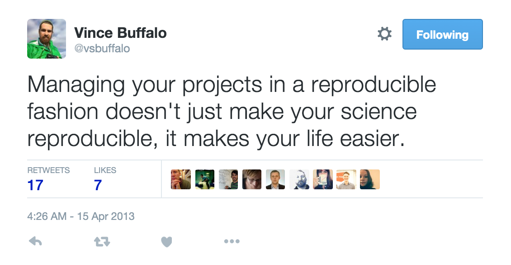

# 2016-01-12 SWC workshop: `R`

----

Please use the EtherPad to take communal notes:

[http://pad.software-carpentry.org/2016-01-11-dundee](http://pad.software-carpentry.org/2016-01-11-dundee)

---

## `R` for reproducible scientific analysis

----

### Learning objectives

* Fundamentals of `R`
* Best practices for organising code
* Best practices for reproducibility

---

## Introduction to `R` and `RStudio`

----

### Learning objectives

* Familiarity with the RStudio IDE
* Set up a working directory with version control
* Introduce `R` syntax
* Introduce package management

----

### Why `R`/`RStudio`?

* Open source & free
* Better than commercial alternatives
* Available on all platforms
* Widely used, good community
* Is a programming language: 
  - scripting
  - automation
  - reproducibility
  - sharing

----

### `R`/`RStudio` presentation

**Live Presentation**



----

### Best practices

* No single 'best' way - only good principles
* Treat your data as read only (separate folder)
  * (cf. `Excel`'s interactive modification)
* Data cleaning
  * Keep 'cleaned' data in a separate folder
* All generated output should be considered disposable

----

### Creating files/directories

**Live Presentation**

----

### Challenge 1

* Download [gapminder-FiveYearData.csv](https://raw.githubusercontent.com/widdowquinn/2016-01-11-dundee/gh-pages/lessons/R_gapminder/data/gapminder-FiveYearData.csv) to `data` subfolder (link on Etherpad)
* Create a new subdirectory called `graphs` in your working directory
* Modify `.gitignore` so that Git does not track the `graphs/` directory
* Commit these changes to the local repository

(10min)


----

### `R` as a calculator

**Live Presentation**

```
> 1 + 100
[1] 101
> log10(10)
[1] 1
> 1 != 2
[1] TRUE
> x <- 1/40
```

----

### Good variable names

* letters, numbers, underscores and periods allowed
* cannot start with a number
* no spaces
* don't use existing names (e.g. `mean`, `df`, etc.)

* Explicit (e.g. `weight_kg`)
* Long variable names: **be consistent**
  * `periods.between.words`
  * `underscores_between_words`
  * `camelCaseToSeparateWords`

----

### MCQ1

What is the value of each variable after running the following program?

```
mass <- 47.5
age <- 122
mass <- mass * 2.3
age <- age - 20
```

* `mass = 47.5, age = 102`
* `mass = 109.25, age = 102`
* `mass = 47.5, age = 122`
* `mass = 109.25, age = 122`

----

### Package Management

**Live Presentation**

```
installed.packages()
install.packages("packagename")
update.packages()
remove.packages("packagename")
library(packagename)
```

----

### Challenge 2

* Install the following packages:
  * `plyr`
  * `gapminder`
  * `dplyr`
  * `tidyr`

(5min)


----

### Functions, and getting help

* Function ≈ "canned script", automates something complicated or convenient
* Some functions built-in (`base` packages e.g. `sqrt()`, `log()`, `lm()`)
* Some functions require package import with `library()`

```
fname(arg1, arg2, ...)
```

* Functions usually take *argument*s - some *default*s (e.g. which symbol for a plot)
* Functions often return *value*s

----

### Getting help for functions

**Live Presentation**

```
args(fname)
?fname
help(fname)
??fname
help.search("text")
vignette(fname)
```

----

### Where can I get more help?

* Ask locally: Colleagues? R user group?
* Google: [Search with your error message](http://lmgtfy.com/?q=R+error+message)
* Stack Overflow (`[r]` tag): [http://stackoverflow.com/questions/tagged/r](http://stackoverflow.com/questions/tagged/r)
* `R-help` mailing list: [https://stat.ethz.ch/mailman/listinfo/r-help](https://stat.ethz.ch/mailman/listinfo/r-help)
* Other topic-specific mailing lists: [http://www.r-project.org/mail.html](http://www.r-project.org/mail.html)

----

### Asking the right questions

* Make it easy for the person you're asking!
* Make the simplest possible example that reproduces the error
* Provide code and data
* For small data: `dput()` to write the data
* For large data use `saveRDS()` or provide the raw data file and script
* Use `sessionInfo()` to provide information about your platform

---

## Data Types and Structures in `R`

----

### Learning Objectives

* Basic data types in `R`
* Some common data structures in `R`
* How to find out the type/structure of data in `R`

----

### Five "atomic" data types

Every piece of data in `R` is one of these:

* logical: (`TRUE`, `FALSE`)
* numeric:
  * integer (e.g. `2L`, `as.integer(3)`)
  * double ('decimal' e.g. `-23.45`, 'pi', '3.0')
* complex: ('complex numbers' e.g. `3+0i`, `1+4i`)
* character: ('text', e.g. `"a""`, `'SWC'`, `"This is not a string"`)
* raw: (binary data)

All data structures are built from them

----

### Atomic data types

**Live Presentation**

```
typeof()
class()
str()
is.logical()
is.numeric()
is.complex()
is.character()
is.integer()
```

----

### Challenge 1

Create examples of data with the following characteristics:

* Variable name: `answer`, Type: `logical`
* Variable name: `height`, Type: `numeric`
* Variable name: `dog_name`, Type: `character`

For each variable you create, test that it has the data type you intended.

(5min)


----

### Five data structures

Five common data structures in `R`:


* vector
* factor
* list
* matrix
* `data.frame`

----

### Vectors

* Most common data structure
* Can only contain a single *data type*: "atomic vectors"

**Live Presentation**

```
x <- c(10, 12, 45, 33)
length(x)
str(x)
xx <- c(1, 2, 'a')
```

----

### Challenge 2

Vectors are "atomic": they can only contain one type.

What data type are the following vectors (`xx`)?

* `xx <- c(1.7, "a")`
* `xx <- c(TRUE, 2)`
* `xx <- c("a", TRUE)`

(`logical`, `integer`, `numeric`, `character`)


----

### Coercion

* *Coercion* is changing data from one type to another
* `R` performs *implicit* conversion on vectors

`logical` > `integer` > `numeric` > `complex` > `character`

* **If input data has formatting problems, you may not have the type you expect in `R`**
* Manual coercion: `as.<class_name>()`
  * Coercion not always possible


----

### Useful vector functions

**Live Presentation**

```
head(x)
tail(x)
length(x)
str(x)
names(x)
```

----

### Factors

* Data typically comes in two forms:
  * continuous (i.e. real numbers)
  * discrete, a.k.a. *categorical* (i.e. classes - may be coded by numbers; may be ordered or unordered)
* This distinction is critical for statistical modelling, e.g. `aov()`, `lm()`, `glm()`
  
* *Factors* are special vectors that represent categorical data
  * Stored as labelled integers
  * Cannot be treated as strings
* Factors may contain *only* predefined values

----

### Factors demo

**Live Presentation**

```
x <- factor(c('yes', 'no', 'yes'))
str(x)
levels(x)
```

----

### Matrices

**Live Presentation**

```
matrix(data, ncol=k, nrow=m)
```

----

### Challenge 3

(5min)

* Create a matrix with 5 columns and 10 rows, containing the numbers `1:50`
* Did the `matrix()` function fill the matrix by column or by row?
* If the matrix filled by row, create a new matrix that fills by column (and *vice versa*)
  * Hint: read the documentation for `matrix()`


----

### Lists

* Lists can hold any combination of data type
  * the basis for `data.frame`s
  * elements denoted by `[[]]`, and can be named
* Very useful for storing function results

**Live Presentation**

```
x <- list(1, 'a', TRUE)
x[[3]]
xlist <- list(a="SWC", b=1:4)
xlist$a
```

----

### Challenge 4

(5min)

* Creata list of length two containing a character vector for each of the sections in this part of the workshop:
  * Data types
  * Data structures
* Populate each character vector with the names of the data types and data structures we’ve seen so far.


---

## Data Frames

----

### Learning Objectives

* Understand the concept of a `data.frame`
* Understand how to access any element of a `data.frame`
* Read data into a `data.frame`

----

### `data.frame`s

* The standard `R` structure for storing tabular, 'rectangular' data
* A collection (`list`) of vectors of identical lengths
  * each vector is a column
  * each vector can be a different data type
* *a bit like a spreadsheet: rows and columns*

----

### My First `data.frame`!

**Live Presentation**

```
df <- data.frame(a=c(1,2,3), b=c('eeny', 'meeny', 'miney'),
                 c=c(TRUE, FALSE, TRUE))
str(df)
df$c
length(df)
dim(df)
summary(df)
```

----

### Challenge 1

(5min)

* There are a few mistakes in this hand crafted `data.frame`, can you spot and fix them?
  * Don’t hesitate to experiment!

```
author_book <- data.frame(author_first=c("Charles", "Ernst",
                                         "Theodosius"),
                          author_last=c(Darwin, Mayr, Dobzhansky),
                          year=c(1942, 1970))
```


----

### Challenge 2

(5min)

* Can you predict the class for each of the columns in the following example?

```
country_climate <- data.frame(country=c("Canada", "Panama", 
                                    "South Africa", "Australia"),
                               climate=c("cold", "hot", 
                                    "temperate", "hot/temperate"),
                               temperature=c(10, 30, 18, "15"),
                               northern_hemisphere=c(TRUE, TRUE, 
                                     FALSE, "FALSE"),
                               has_kangaroo=c(FALSE, FALSE, 
                                     FALSE, 1))
```

(`logical`, `numeric`, `character`, `factor`)


----

### Adding rows and columns

**Live Presentation**

```
df <- cbind(df, vals=6:1)
colnames(df)
df <- rbind(df, list('g', 11, 43, 0, 'G'))
```

----

### Reading in data

* Using the Gapminder data we downloaded earlier
  * in `data/` subdirectory
* Inspect using `RStudio` (click on file)

**Live Presentation**

```
read.table(<filename>, sep=",", header=TRUE)
read.csv(<URL>)
```

---

## Indexing and Subsetting data

----

### Learning objectives

* To extract useful subsets of vectors, factors, and data frames
* To extract individual and multiple elements
  * By index
  * By name
  * By comparison operations
* To skip and remove elements

----

### Subset by index

* Every element in a collection (vector, list, etc.) is indexed
  * This index can be used to identify the element

**Live Presentation**

```
x <- c(5.4, 6.2, 7.1, 4.8, 7.5)
x[4]
x[c(1,3)]
x[1:3]
x[0]
x[-2]
x[c(-2, -4)]
```

----

### Challenge 1

(5min)

* The last line of the following code does *not* skip elements 1 to 3. Can you modify it so that it does?

```
x <- c(5.4, 6.2, 7.1, 4.8, 7.5)
names(x) <- letters[1:5]
x[-1:3]
```


----

### Logical masks

* We can create a *mask* of `logical` (`TRUE`/`FALSE`) values to decide whether to extract/skip elements
  * This is the basis for "subsetting by name"
  
**Live Presentation**

```
x <- c(5.4, 6.2, 7.1, 4.8, 7.5)
mask <- c(TRUE, FALSE, TRUE, FALSE, TRUE)
x[mask]
x[x > 7]
x[x > 4 & x < 7]
```

----

### Challenge 2

(5min)

* Given the following code, can you subset the data to return values in `x` that are less than 5 or greater than 7?

```
x <- c(5.4, 6.2, 7.1, 4.8, 7.5)
names(x) <- letters[1:5]
print(x)
  a   b   c   d   e 
5.4 6.2 7.1 4.8 7.5 
```


----

### Subset by name

* We can extract subsets from named collections (named vectors, `data.frame`s) by element names
* Names tend to be attached consistently to data
  * indices can change if datasets are modified - less robust

**Live Presentation**

```
x['c']
x[c("a", "c")]
x[names(x) == "a"]
x[names(x) != "a"]
x[which(names(x) == "a")]
x[-which(names(x) != "a")]
x[which(names(x) %in% c("a", "c"))]
```

----

### Challenge 3

(5min)

* Given the following code, can you subset the data to return all values labelled `a` 

```
> x <- 1:6
> names(x) <- c('a', 'b', 'a', 'c', 'd', 'a')
> x
a b a c d a 
1 2 3 4 5 6 
```


----

### Subsets of matrices

* Matrices are 2-dimensional vectors
  * Specify row and column indexes
  
**Live Presentation**

```
m <- matrix(rnorm(6*4), ncol=4, nrow=6)
m[3:4, c(3,1)]
m[3:4,]
```

----

### Subsets of lists

* Lists are collections of several data types
* Three operators
  * `[]` returns a list
  * `[[]]` returns an element
  * `$` returns a named element
* Can subset within each element
  
**Live Presentation**

```
xlist <- list(a="SWC", b=1:10, data=head(iris))
xlist[1:2]
xlist[[2]]
xlist[["data"]]
xlist$b
xlist$data[4,]
```

----

### Subsets of `data.frame`s

* `data.frame`s are essentially lists, and subset in the same way
  * (but, as 2D data, some similarity to matrices)

**Live Presentation**

```
gapminder[3]
gapminder[["lifeExp"]]
gapminder$year
gapminder[1:3,]
gapminder[3,]
gapminder[, 3, drop=FALSE]
```

----

### Challenge 4

* Can you fix the following `data.frame` subsetting errors?

- Extract observations collected for the year 1957
```
gapminder[gapminder$year = 1957,]
```
- Extract all columns except 1 through to 4
```
gapminder[,-1:4]
```
- Advanced: extract rows for years 2002 and 2007
```
gapminder[gapminder$year == 2002 | 2007,]
```


---

## `data.frame` manipulation with `dplyr`

----

### Learning objectives

* To be able to manipulate data using the six *verbs* of `dplyr`
  * `select()`
  * `filter()`
  * `group_by()`
  * `summarize()`
  * `mutate()`
  * `%>%` (pipe)

----

### What and why is `dplyr`?

* Many analyses involve analyses of observations by *groups*
  * Can be very repetitious
  
```
> mean(gapminder[gapminder$continent == "Africa", "gdpPercap"])
[1] 2193.755
> mean(gapminder[gapminder$continent == "Americas", "gdpPercap"])
[1] 7136.11
> mean(gapminder[gapminder$continent == "Asia", "gdpPercap"])
[1] 7902.15
``` 

* Avoiding repetition (by automation, wise programming) makes code 
  * robust (fewer errors/bugs)
  * reproducible
and saves time

----

### Split-Apply-combine


----

### What and why is `dplyr`?
  
* `dplyr` provides tools for common data manipulation tasks
  * built for `data.frame`s and split-apply-combine
  * (can also work with data in external databases, for large datasets)

**Live Presentation**

```
library(dplyr)
```

----

### `select()`


----

### `select() and filter()`

**Live Presentation**

```
select(gapminder, year, country, gdpPercap)
gapminder %>% select(year, country, gdpPercap)
filter(gapminder, continent=="Europe")
gapminder %>% filter(continent=="Europe") 
          %>% select(year, country, gdpPercap)
```

----

### Challenge 1

* Can you write a single command (which can span multiple lines and includes pipes) that will produce a dataframe that has the African values for lifeExp, country and year, but not for other Continents.
* How many rows does the resulting dataframe have and why?


----

### Reducing repetition

* What if we want similar results for all continents?
  * Still need to repeat the application of `select()` and `filter()` - not great!
  
* Use `dplyr`'s `group_by()` and `summarize()` functions

----

### `group_by()`


----

### `summarize()`


----

### `group_by()` and `summarize()`

* Using `group_by()` and `summarize()` is very powerful
  * If you're familiar with RDBMS/SQL…
  
**Live Presentation**

```
gapminder %>% group_by(continent)
gapminder %>% group_by(continent)
          %>% summarize(meangdpPercap=mean(gdpPercap))
```

----

### Challenge 2

* Calculate the average life expectancy per country in the `gapminder` data.
* Which had the longest life expectancy and which had the shortest life expectancy?


----

### Group by multiple variables

* We're not restricted to grouping, or summarising only on single variables

**Live Presentation**

```
> gdp_bycontinent_byyear <- gapminder %>%
+ group_by(continent, year) %>%
+ summarize(mean_gdpPercap=mean(gdpPercap))
```

----

### `mutate()`

* `dplyr`'s `mutate()` function allows creation of new variables
  * We can do this before or after summarising
  * Unit conversions, ratios, derived values, etc.
  
**Live Presentation**

```
gapminder %>% mutate(gdp_billion=gdpPercap*pop/10^9)
```