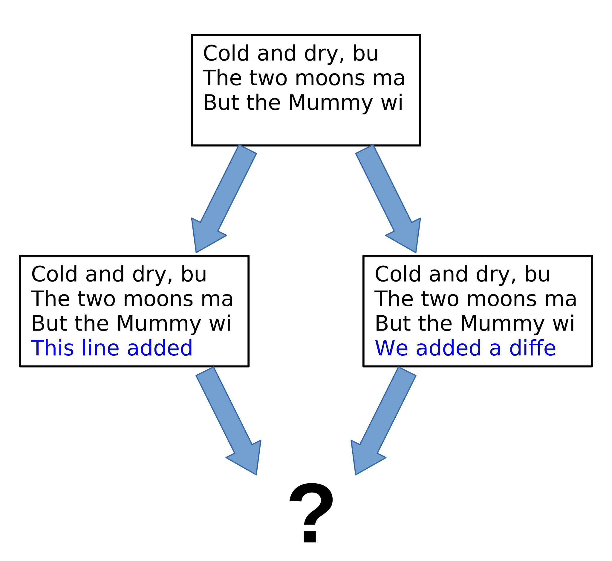

# 2016-01-11 SWC workshop: git

----

Please use the EtherPad to take communal notes:

[http://pad.software-carpentry.org/2016-01-11-dundee](http://pad.software-carpentry.org/2016-01-11-dundee)

---

## Version control with `git`

----

### Learning objectives

* Understand the basics of automated version control
* Understand the basics of `git`

----

### Do you recognise this?

(a.k.a. have you ever worked on the same document as someone else?)


----

### How version control works

* Version control is like a 'recording' of history


* Rewind and play back changes

----

### Multiple editors (branching)

* Two people work on a document
  * Each makes independent changes: two versions
  


* Changes are separate from the document itself

----

### Combining changes (merging)

* Several changes can be merged onto the same base document
  * 'Merging'


----

### What version control systems do

* Version control systems manage this process
  * track changes
  * store metadata (who, when)
  * record 'versions' (a.k.a. *commits*)
* The complete history of *commits* and metadata is a *repository*
* CVS, Subversion, RCS: legacy systems
* `git`, Mercurial: modern VC tools

---

## Setting up `git`

----

### Learning objectives

* Configure `git` for first use on a computer
* Understand `git config --global`

----

### Setting global options

* `git` needs to know who you are for metadata
* `git` wants your preferences for display/editing

**Live Presentation**

```
git config --global user.name "Vlad Dracula"
git config --global user.email "vlad@tran.sylvan.ia"
git config --global color.ui "auto"
git config --global core.editor "nano -w"
```

---

## Creating a repository

----

### Learning objectives

* Create a local `git` repository

----

### Creating a `git`repository

* A fictional project about planets

**Live Presentation**

```
git init
git status
```

---

## Tracking changes

----

### Learning objectives

* Practice the modify-add-commit cycle
* Understand where information is stored in the `git` workflow

----

### My first untracked file

* We'll create a file, but do nothing with it
  * "Is Mars suitable as a space base?" 

**Live Presentation**

```
nano mars.txt
```

----

### My first `git` commit

* We tell `git` that it should *track* a file (watch for changes)
* We also `commit` the file (keep a copy of the file in the *repository*, in its current state)

**Live Presentation**

```
git add mars.txt
git commit -m "Start notes on Mars as a base"
git log
```

----

### The staging area

* We don't always want to commit all changes
* The *staging area* holds changes we want to commit
  * (other files may also be changed, but we don't want to commit them)


----

### modify-add-commit

* Now we want to add more information to the file
  * Modify file
  * Add file to *staging area* (`git add`)
  * Commit changes

**Live Presentation**

```
nano mars.txt
git diff
git add mars.txt
git diff
git commit
```

----

### Challenge 1

(5min)

* Make a one-line change to `mars.txt`.
* Create file called `earth.txt` containing one-line comment on Earth.
* Commit changes to the repository (as a single `commit`)


----

### The modify-add-commit lifecycle


---

## Exploring history

----

### Learning objectives

* Compare various versions of tracked files
* Restore old versions of files
* Identify and use `git` commit numbers

----

### Commit history

* Most recent commit: `HEAD`
* Next-most recent: `HEAD~1`
* Next-next-most recent: `HEAD~2`


----

### History with `git diff`

* We can use `git diff` to see what changed for a file at each commit

**Live Presentation**

```
git diff HEAD~1 mars.txt
git diff HEAD~2 mars.txt
```

----

### History with commit IDs

* We can use the unique ID for a commit in the same way

**Live Presentation**

```
git diff d22195b9ec3c8fb4c2ce0f52f344b95ce5d0d0e3 mars.txt
git diff d221 mars.txt
```

----

### Restoring older versions

* How can we restore older versions/backtrack?
* Let's say we accidentally overwrite a file…

**Live Presentation**

```
git checkout HEAD mars.txt 
```

----

### `git checkout`

* `git checkout` "checks out" (restores) old file versions
  * Can use any commit identifier
  * Check out the commit *before* the change you want to remove!


----

### Question

- Which commands below will let Jennifer recover the last committed version of her Python script called `data_cruncher.py`?


1. `$ git checkout HEAD`
2. `$ git checkout HEAD data_cruncher.py`
3. `$ git checkout HEAD~1 data_cruncher.py`
4. `$ git checkout <unique ID of last commit> data_cruncher.py`

---

## Ignoring things

----

### Learning objectives

* Configure `git` to ignore files and directories
* Understand why this is useful

----

### Not all files are useful

* Editor backup files
* Temporary files
* Intermediate analysis files

**Live Presentation**

```
mkdir results
touch a.dat results/a.out
```

----

### `.gitignore`

* `.gitignore` is a special file in your repository root 
  * It tells `git` to ignore specified files/directories
  * It should be committed in your repository

**Live Presentation**

```
nano .gitignore
git status --ignored
git add -f b.dat
```

---

## Remotes in GitHub

----

### Learning objectives

* What remote repositories are and why they are useful
* To clone a remote repository
* To push to and pull from a remote repository

----

### Remote repositories

* Version control most useful for collaboration
  * Easiest to have a single repository
  * Repository may be hosted off-site (for at least one collaborator)
* Services available:
  * GitHub, BitBucket, GitLab
* We're using GitHub

----

### Log in to GitHub

* Register for an account, if you don't have one - then log in


----

### Create a remote repository

* Essentially, on GitHub's servers:

```
mkdir planets
cd planets
git init
``` 

**Live Presentation**

----

### A freshly-made GitHub repository

* There's nothing in the remote repository!


----

### Connecting local and remote repositories

* We tell the *local* repository that the GitHub repository is its *remote* repository.
  * `origin` is a local nickname for the remote repo (a common choice)
  * Once set up, we *push* changes/history to the remote repo

**Live Presentation**

```
git remote add origin https://github.com/widdowquinn/planets.git
git push origin master
```

----

### Remote GitHub repo after first *push*

* We only *push* the repository, not the staging area


----

### My first remote *pull*

* To synchronise the local repo with the remote repo, we *pull*

**Live Presentation**

```
git pull origin master
```

---

## GitHub collaboration

----

### Learning objectives

* Collaborate pushing changes to someone else's remote repository

----

### Starting a collaboration

* Pair up as 'host' and 'collaborator'
* as *host*: give GitHub repo access to your collaborator
* as *collaborator*: clone your host's repo

**Live Presentation**

```
cd /tmp/
git clone https://github.com/<collaborator>/planets.git
git remote -v
```

----

### Make a collaborative change

* Add a file called `pluto.txt` - (content your own)

**Live Presentation**

```
cd planets
nano pluto.txt
git add pluto.txt
git commit -m "Notes on Pluto"
git push origin master
```

----

### Pull a collaborator's change

* Change back to your own (*host*) repository
  * Check with `git remote -v`
* Pull the changes made by your collaborator

**Live Presentation**

```
cd ~/planets/
git pull origin master
```

---

## Resolving `git` conflicts

----

### Learning objectives

* Understand what conflicts are, and when they occur
* To be able to resolve conflicts resulting from a merge

----

### Why conflicts occur

* People working in parallel
  * different changes to same part of a file
  * not keeping local repo in sync before making local changes
  * not keeping remote repo in sync after making local changes
* `git pull` before working; `git push` when done

----

### Let's make a conflict

* As the *host*: add a line to `mars.txt`
  * Commit and push the change
* As the *collaborator*: add a line to `mars.txt`
  * Commit and push the change

**Live Presentation**

```
cd ~/planets
nano mars.txt
git push origin master
cd /tmp/planets
nano mars.txt
git push origin master
```

----

### The conflict message

```
To https://github.com/<collaborator>/planets.git
 ! [rejected]        master -> master (fetch first)
error: failed to push some refs to 'https://github.com/<collaborator>/planets.git'
hint: Updates were rejected because the remote contains work that you do
hint: not have locally. This is usually caused by another repository pushing
hint: to the same ref. You may want to first integrate the remote changes
hint: (e.g., 'git pull ...') before pushing again.
hint: See the 'Note about fast-forwards' in 'git push --help' for details.
```

----

### The conflicting changes



----

### Resolving a conflict

* `git` detects overlapping changes
  * `git` defers to humans for how to resolve: **communicate**!
  
* To resolve:
  * *pull* remote changes
  * *merge* changes into our working copy
  * *push* the merged changes
  
**Live Presentation**

---

## Wrapping up

* GitHub/version control can be an open electronic lab book
  * Collect data - store in OA repository (Zenodo/FigShare)
  * Use GitHub to store work in progress: analysis lab book
  * Post preprint to (Bio)arXiv
* Even if you don't work openly, it's more reproducible, and reproducible (and auditable)
